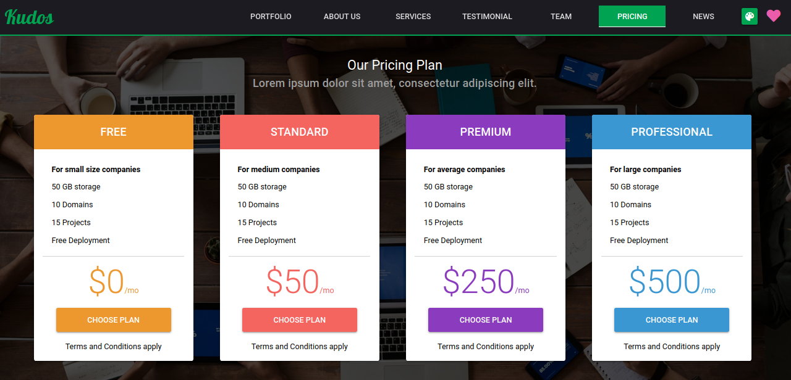
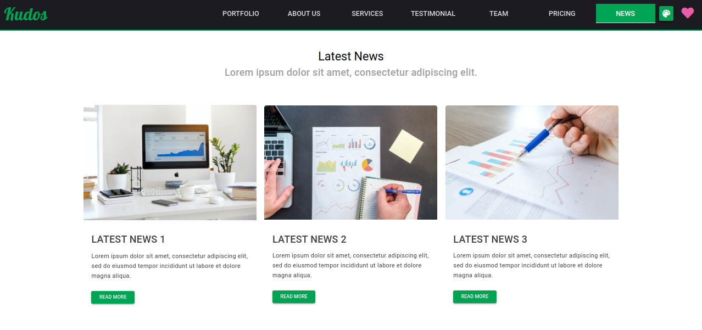

# Company Profile Website Template - Vue.js & Quasar Framework

Free template for company profile made using Quasar Framework and Vue.js! It is a fully responsive template which you can use for your company or maybe for your own portfolio website.

## Site: [https://quasar-company-profile-template.netlify.app/](https://quasar-company-profile-template.netlify.app/)

# Support

If this helped you, you can contribute to this project by supporting me: Unudeveloper

Please check out my sponsor page.

(GitHub currently **doubles your support**! So if you support me with $5/mo, I will get $10 instead! 😉)

Thank you very much!!

## Resources used
* [Quasar Framework](https://quasar.dev/)
* [Vue.js](https://vuejs.org/)

## Installation

* **Clone the repository**

```
git clone https://github.com/unudeveloper/Vue-Company-website.git
```

## Install the dependencies
```bash
cd vue-quasar-company-profile-website
npm install
```

### Start the app in development mode (hot-code reloading, error reporting, etc.)
```bash
quasar dev
```


### Build the app for production
```bash
quasar build
```

Do reach out to me at "unudeveloper@gmail.com" for queries.

## Screens UI
**Home**
<p float="left">
	<kbd>

		</kbd>
</p>

**Portfolio**
<p float="left">
	<kbd>
	
	</kbd>
</p>

**Pricing**
<p float="left">
	<kbd>

	</kbd>
</p>

**News**
<p float="left">
	<kbd>

	</kbd>
</p>
